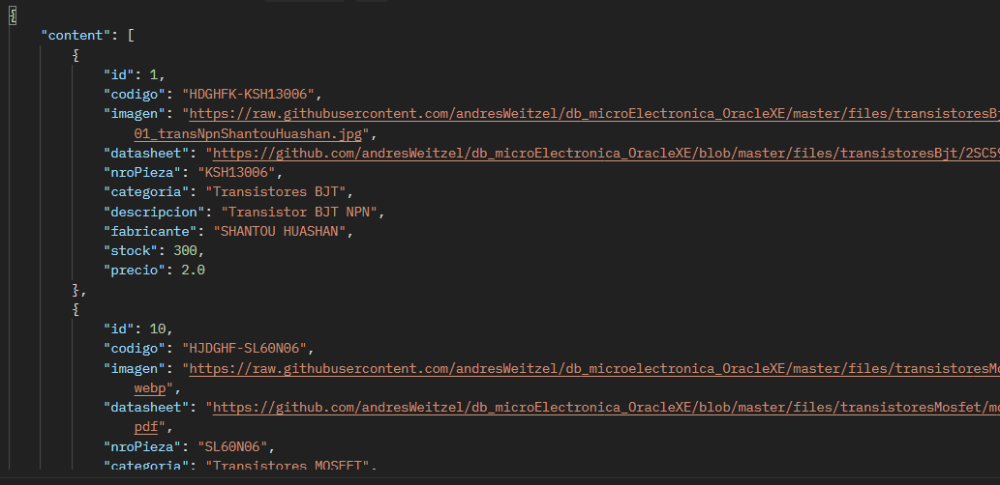

# ApiRest_Microcomponentes_SpringBoot
Api Rest para el manejo de Microcomponentes implementado con Spring Boot, Spring MVC, Spring Data JPA, SpringFox, Swagger UI, Maven, Lombok, Postman, Log4j, Git, SQLDeveloper, Oracle XE 21c y Otras Tecnologías.
* [Micro_Frontend_Microcomponentes_React](https://github.com/andresWeitzel/App_MicroFrontEnd_MicroElectr_React)
* [db_Microcomponentes_OracleXE](https://github.com/andresWeitzel/db_microElectronica_OracleXE)
* [Api base para migración](https://github.com/andresWeitzel/ApiRest_Microelectronica_SpringBoot_Oracle)
* [PlayList](https://www.youtube.com/playlist?list=PLCl11UFjHurDnmm7zqPOgpPu0fAuOHa9S)

<br>

## Índice 📜

<details>
 <summary> Ver </summary>
 
 <br>

 
### Sección 1) Descripción, Tecnologías y Dependencias 

 - [1.0) Descripción del Proyecto.](#10-descripción-)
 - [1.1) Ejecución del Proyecto.](#11-ejecución-del-proyecto-)
 - [1.2) Patrones de Diseño.](#12-patrones-de-diseño-)
 - [1.3) Tecnologías.](#13-tecnologías-)
 - [1.4) Dependencias Maven.](#14-dependencias-maven-)

  
### Sección 2) Endpoints y Recursos 
 
 - [2.0) EndPoints.](#20-endpoints-)
 - [2.1) Recursos por endpoints.](#21-recursos-por-endpoints-)
  
  
### Sección 3) Prueba de Funcionalidad y Referencias
 
 - [3.0) Prueba de Funcionalidad.](#30-prueba-de-funcionalidad-)
 - [3.1) Referencias.](#31-referencias-)
	  

</details>


<br>


## Sección 1) Descripción, Tecnologías y Dependencias 


### 1.0) Descripción [🔝](#índice-) 

<details>
 <summary>Ver</summary>
 
 <br>

* Microservicio Api Rest acerca de microcomponentes de electrónica implementado con Spring Boot, Spring MVC, Spring Data JPA, SpringFox, Swagger UI, Maven, Lombok, Postman, Log4j, Git, SQLDeveloper, Oracle XE 21c y Otras Tecnologías.
* Para este Microservicio no se implementa la capa de seguridad, es posible realizarlo con Spring Security (visualizar otras Api's Rest en mi perfíl de github).
* Se incluye documentación con Swagger 2 / Spring Fox para cada recurso junto con los códigos de respuesta Http más usados. Además se agrega doc junto con validaciones para cada Bean.
* Los Objetos de Búsqueda se trabajan como paginados, incluyendo algunos de tipo CRUD. Se implementa manejos de Excepciones con clases específicas para su control.
* Entre Otros.

 
<br>

</details>


### 1.1) Ejecución del Proyecto [🔝](#índice-)

<details>
  <summary>Ver</summary>
  
 <br>  
  
* Descargamos y levantamos [Oracle XE](https://www.oracle.com/database/technologies/appdev/xe.html) para ejecutar los servicios de base de datos.
* Abrimos una terminal y clonamos el [repo de base de datos](https://github.com/andresWeitzel/db_Microcomponentes_OracleXE).
* Creamos y configuramos una conexión de oracle para la ejcución de los archivos de db.
* Para más info. consultar repositorio respectivo
* Descargamos [Spring tool suite 4](https://spring.io/tools)
* Desde sts u otro ide abrimos una terminal y creamos un entorno de trabajo o workspace.
* Clonar el Proyecto
```git
git clone https://github.com/andresWeitzel/ApiRest_Microcomponentes_SpringBoot
```
* Click der sobre el proyecto --> Run as --> Spring Boot App
* Ya tenemos corriendo nuestra api desde tomcat. El url de la app para la ejecución de los endpoint's lo visualizamos desde consola.

<br>

</details>

### 1.2) Patrones de Diseño [🔝](#índice-)

<details>
 <summary>Ver</summary>
 
 <br>

| **Patrón de Diseño** | **Finalidad** |               
| ------------- | ------------- |
| [DAO](https://www.oscarblancarteblog.com/2018/12/10/data-access-object-dao-pattern/) | Uso de interfaces entre la aplicación y el almacenamiento de datos. |
| [MVC](https://keepcoding.io/blog/que-es-el-patron-de-arquitectura-mvvm/) | Separación y Representación de los Datos, Manejo de errores, Escalabilidad, etc  |
| [DTO](https://www.oscarblancarteblog.com/2018/11/30/data-transfer-object-dto-patron-diseno/) | Transferencia de objectos separando la capa de acceso a datos  |
| [Dependency Inyection](https://stackify.com/dependency-injection/) | Uso de funcionalidades requeridas de clases a través de inyección |
| Otros | Otros |

<br>

</details>


### 1.3) Tecnologías [🔝](#índice-)

<details>
 <summary>Ver</summary>
 
 <br>

| **Tecnologías** | **Versión** | **Finalidad** |           
| ------------- | ------------- | ------------- |
| [Java](https://docs.oracle.com/en/) |  12.0.2 | JDK |
| [Spring Tool Suite 4](https://spring.io/blog/2021/06/21/spring-tools-4-11-0-released) | 4.9.0  | IDE |
| [Spring Boot](https://spring.io/) |  2.6.4  | Framework |
| [Spring Boot Data JPA](https://spring.io/projects/spring-data-jpa)  | 2.6.3 | Mapeo de objetos y persistencia en la db |
| [Spring Validation](https://www.baeldung.com/spring-boot-bean-validation)  | 2.7 | Anotations para Validaciones |
| [Spring Security](https://spring.io/projects/spring-security)  | 2.6.7 | Módulo de Seguridad de Spring |
| [Json Web Token](https://jwt.io/)  | 0.9.1 | Manejo de Token's de Seguridad |
| [SpringFox](https://www.springfox.com/) | 3.0.0 | Documentación de la Api | 
| [Lombok](https://projectlombok.org/) | 1.18.22 | Automatización de Código |
| [Open-Api y UI Swagger](https://www.openapis.org/) | 1.6.4 | Documentación de la Api | 
| [UI Swagger](https://swagger.io/tools/swagger-ui/) | 1.6.4 | Visualización y Gestión de la Api |
| [Oracle XE 21c](https://www.oracle.com/ar/database/technologies/appdev/xe.html) | 21.4.1 | Sistema de Gestión de Bases de Datos |
| [SQL Developer](https://www.oracle.com/database/sqldeveloper/) | 21.4.1  | Editor de Base de Datos |
| [Maven](https://maven.apache.org/) |  4.0.0 | Gestor de Proyectos |
| [Postman](https://www.postman.com/) | 9.1.1 | Visualización y Gestión de la Api | 
| [CMD](https://learn.microsoft.com/en-us/windows-server/administration/windows-commands/cmd) | 10 | Símbolo del Sistema para linea de comandos | 
| [GNU bash / Terminal](https://www.gnu.org/software/bash/) | 4.4.23  | Bash / Terminal para el manejo e implementación de Git. |
| [Git](https://git-scm.com/) | 2.29.1  | Control de Versiones |

<br>

</details>


### 1.4) Dependencias Maven [🔝](#índice-)

<details>
 <summary>Ver</summary>
 
 <br>

| **Dependencia Maven**  | **Versión** | **Finalidad** |             
| ------------- | ------------- | ------------- |
| spring-boot-starter-data-jpa | 2.6.7 | Api de JpaRepository para el manejo de métodos | 
| spring-boot-starter-test | 2.6.7 | Para Testing | 
| spring-boot-starter-web | 2.6.7 | Se agrega toda la configuración web automáticamente de Maven a Spring | 
| spring-boot-starter-validation | 2.7.0 | Validación de Annotations |
| spring-boot-devtools | 2.6.7 | Herramientas para el Manejo de Spring Boot | 
| springfox-boot-starter | 3.0.0 | Doc Api |
| springfox-swagger-ui | 3.0.0 | Doc Api |
| spring-boot-starter-data-mongodb | 2.6.7 | Manejo de SpringDataMongoDB con los métodos del Repository y anotations  |
| springdoc-openapi-ui | 1.6.4 | Plantillas para el Front |
| spring-boot-devtools | 2.6.7 | Herramientas para el Manejo de Spring Boot | 
| spring-boot-devtools | 2.6.4 | Herramientas para el Manejo de Spring Boot | 
| ojdbc8 | 21.3.0.0 | Driver para el SGDB Oracle | 
| lombok | 1.18.22 |  Dependencia para la automatización de Código |


<br>

</details>


<br>

## Sección 2) EndPoints y Recursos

### 2.0) EndPoints [🔝](#índice-)

<details>
 <summary>Ver</summary>
 

<br>

</details>


### 2.1) Recursos y Servicios [🔝](#índice-)

<details>
 <summary>Ver</summary>
 
</br>

</details>

<br>

## Sección 3) Prueba de Funcionalidad y Referencias


### 3.0) Prueba de Funcionalidad [🔝](#índice-)

<details>
 <summary>Ver</summary>

 <br>

</details>


### 3.1) Referencias [🔝](#índice-)

<details>
 <summary>Ver</summary>

 <br>

</details>


